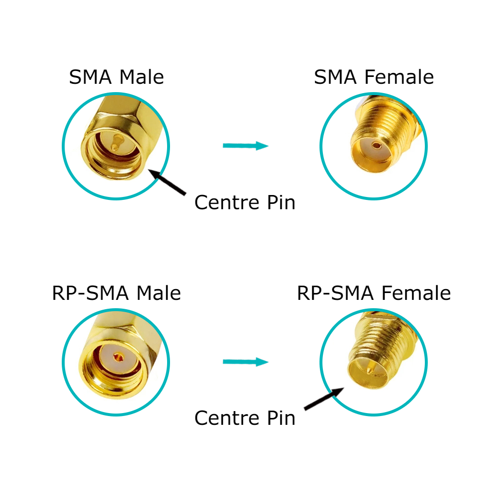

# External antenna for XIAO ESP32C6

You need to add 2 components: Wi-Fi 2.4GHz (or dual-range) antenna, and a _pigtail_ (wire adapter).

You need basic knowledge berfore you buy:

* Wi-Fi 2.4 GHz antennas are OK for BlueTooth LE (BLE) too, as Wi-Fi and BLE share nearly the same 2.4GHz radio frequency ranges.
* Wi-Fi detachable antennas usually have `SMA Male` or `RP-SMA Male` connectors. `RP-SMA` is `Reverse Polarity SMA`

This is not obivious:

* `SMA` and `RP-SMA` connectors are incompatible with each other. This means your antenna and your pigtail must be both `SMA` or both `RP-SMA`.
* `SMA Male` and `RP-SMA Male` connectors are those look like nuts with intgernal thead. 
* `SMA Female` and `RP-SMA Female` connectors are those look like screws with external thead. 
* `SMA` and `RP-SMA` connectors differ with central pin: 
  * `SMA` has pin on `SMA Male` connector and socket on `SMA Female` connector. 
  * `RP-SMA` has socket on `RP-SMA Male` connector and pin on `RP-SMA Female` connector. 

Now, with this knowledge, you need to add 2 components:

* Wi-Fi and BLE antenna: 2.4 GHz or mixed (2.4\5 GHz) Wi-Fi antenna with `SMA Male` or `RP-SMA Male` connector.
* Pigtail: U.FL (also known as UFL, IPX, IPEX, I-PEX, MHF1) adapter wire to Female connector. If your antenna has `SMA Male` connector, then pigtail should have `SMA Female` connectopr. And for `RP-SMA` same logic.

